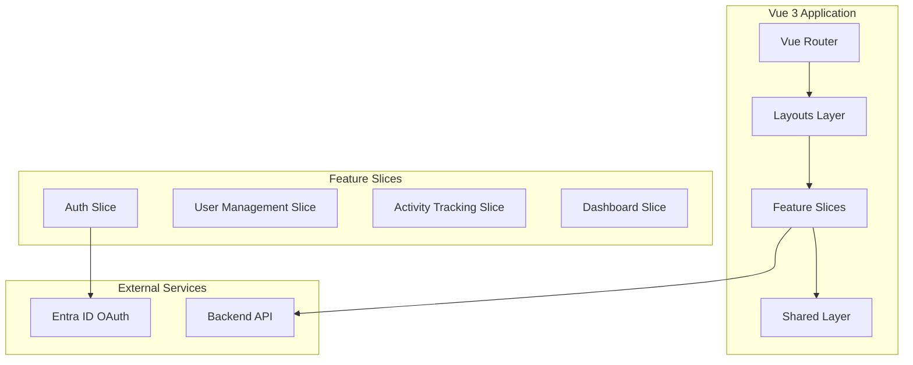
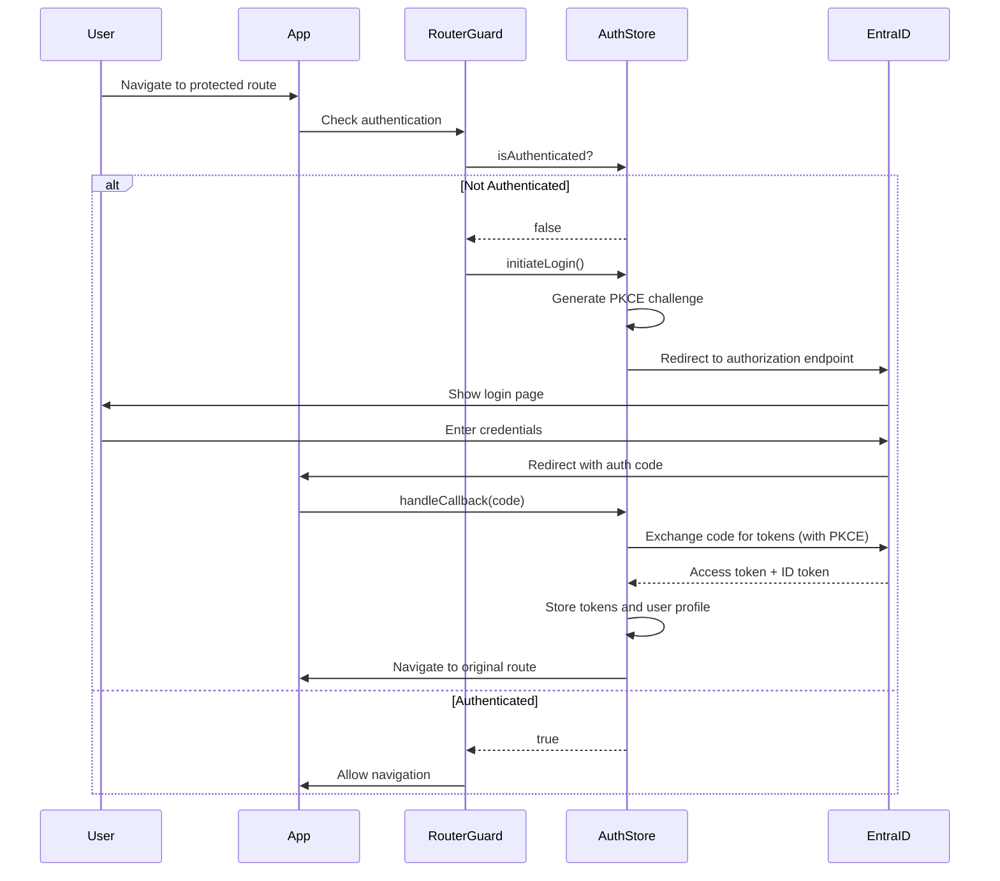

# Design Document

## Overview

This design document outlines the architecture and implementation approach for a Vue 3 + TypeScript Admin UI template built with Vertical Slice Architecture (VSA). The template provides a production-ready foundation for administrative applications with OAuth 2.0 authentication, RBAC, user management, and audit logging.

The design emphasizes:
- **Feature Independence**: Each feature slice is self-contained with its own components, stores, services, and views
- **Type Safety**: Full TypeScript coverage with strict typing
- **Modern Tooling**: Vite for build tooling, Pinia for state management, Vue Router for navigation
- **Consistent UI**: DaisyUI components with Tailwind CSS for rapid, consistent styling
- **Security First**: OAuth 2.0 with PKCE, route guards, and RBAC throughout

## Architecture

### High-Level Architecture



### Vertical Slice Architecture

The application follows VSA principles where each feature is organized as a self-contained slice:

```
src/
├── features/
│   ├── auth/              # Authentication slice
│   ├── users/             # User management slice
│   ├── activity/          # Activity tracking slice
│   └── dashboard/         # Dashboard slice
├── shared/                # Cross-cutting concerns
│   ├── ui/               # Reusable components
│   ├── types/            # Global TypeScript types
│   ├── composables/      # Shared composables
│   ├── guards/           # Router guards
│   └── utils/            # Utility functions
├── layouts/              # Layout components
└── router/               # Router configuration
```

Each feature slice contains:
- **components/**: Feature-specific Vue components
- **stores/**: Pinia stores for state management
- **services/**: API communication and business logic
- **views/**: Route-level components

### Authentication Flow



### State Management Architecture

Each feature slice manages its own state through Pinia stores:

- **authStore**: Authentication state, tokens, user profile, login/logout methods
- **userStore**: User list, pagination, search filters, CRUD operations
- **activityStore**: Audit log entries, filters, pagination
- **themeStore**: Theme preference (light/dark)
- **notificationStore**: Toast notifications queue

Stores communicate with backend services but remain independent of each other.

## Components and Interfaces

### Auth Slice

**Components:**
- `LoginView.vue`: OAuth login initiation page
- `CallbackView.vue`: OAuth callback handler
- `ProfileView.vue`: User profile display and editing

**Store (authStore.ts):**
```typescript
interface AuthState {
  isAuthenticated: boolean
  user: UserProfile | null
  accessToken: string | null
  idToken: string | null
  tokenExpiry: number | null
}

interface AuthStore {
  // State
  state: AuthState
  
  // Getters
  isAuthenticated: boolean
  userRoles: string[]
  hasPermission: (permission: string) => boolean
  
  // Actions
  initiateLogin: () => Promise<void>
  handleCallback: (code: string) => Promise<void>
  logout: () => Promise<void>
  refreshToken: () => Promise<void>
}
```

**Service (authService.ts):**
```typescript
interface AuthService {
  generatePKCEChallenge: () => { verifier: string; challenge: string }
  exchangeCodeForTokens: (code: string, verifier: string) => Promise<TokenResponse>
  getUserProfile: (accessToken: string) => Promise<UserProfile>
  revokeTokens: (accessToken: string) => Promise<void>
}
```

### Users Slice

**Components:**
- `UserTable.vue`: Paginated user list with search
- `UserRoleModal.vue`: Role assignment dialog
- `UserFilters.vue`: Search and filter controls

**Store (userStore.ts):**
```typescript
interface UserState {
  users: User[]
  totalCount: number
  currentPage: number
  pageSize: number
  searchQuery: string
  loading: boolean
}

interface UserStore {
  // State
  state: UserState
  
  // Getters
  filteredUsers: User[]
  totalPages: number
  
  // Actions
  fetchUsers: (page: number) => Promise<void>
  searchUsers: (query: string) => Promise<void>
  updateUserRoles: (userId: string, roles: string[]) => Promise<void>
}
```

**Service (userService.ts):**
```typescript
interface UserService {
  getUsers: (params: PaginationParams) => Promise<PaginatedResponse<User>>
  searchUsers: (query: string, params: PaginationParams) => Promise<PaginatedResponse<User>>
  updateUserRoles: (userId: string, roles: string[]) => Promise<User>
}
```

### Activity Slice

**Components:**
- `ActivityTable.vue`: Audit log table with sorting
- `ActivityFilters.vue`: Date range, user, and action type filters

**Store (activityStore.ts):**
```typescript
interface ActivityState {
  logs: ActivityLog[]
  totalCount: number
  currentPage: number
  filters: ActivityFilters
  loading: boolean
}

interface ActivityStore {
  // State
  state: ActivityState
  
  // Getters
  filteredLogs: ActivityLog[]
  
  // Actions
  fetchLogs: (page: number) => Promise<void>
  applyFilters: (filters: ActivityFilters) => Promise<void>
}
```

**Service (activityService.ts):**
```typescript
interface ActivityService {
  getLogs: (params: ActivityQueryParams) => Promise<PaginatedResponse<ActivityLog>>
}
```

### Dashboard Slice

**Components:**
- `DashboardView.vue`: Main dashboard with stats cards
- `StatsCard.vue`: Reusable statistics display component

### Shared Layer

**UI Components (shared/ui/):**
- `AppLayout.vue`: Main layout with sidebar and navbar
- `Sidebar.vue`: Collapsible navigation sidebar
- `Navbar.vue`: Top navigation bar with user menu
- `Breadcrumbs.vue`: Dynamic breadcrumb navigation
- `ThemeToggle.vue`: Light/dark theme switcher
- `NotificationToast.vue`: Toast notification component

**Composables (shared/composables/):**
- `useNotification.ts`: Global notification system
- `useTheme.ts`: Theme management
- `usePermissions.ts`: Permission checking helper

**Guards (shared/guards/):**
- `authGuard.ts`: Route protection logic

**Types (shared/types/):**
- `auth.types.ts`: Authentication-related interfaces
- `user.types.ts`: User and role interfaces
- `activity.types.ts`: Activity log interfaces
- `api.types.ts`: API response interfaces

## Data Models

### Authentication Models

```typescript
interface UserProfile {
  id: string
  email: string
  name: string
  roles: string[]
  permissions: string[]
}

interface TokenResponse {
  access_token: string
  id_token: string
  token_type: string
  expires_in: number
  refresh_token?: string
}

interface OAuthConfig {
  authorizationEndpoint: string
  tokenEndpoint: string
  clientId: string
  redirectUri: string
  postLogoutUri: string
  scope: string
}
```

### User Management Models

```typescript
interface User {
  id: string
  email: string
  name: string
  roles: string[]
  status: 'active' | 'inactive' | 'suspended'
  createdAt: string
  lastLoginAt: string | null
}

interface Role {
  id: string
  name: string
  permissions: string[]
  description: string
}

interface PaginationParams {
  page: number
  pageSize: number
  sortBy?: string
  sortOrder?: 'asc' | 'desc'
}

interface PaginatedResponse<T> {
  data: T[]
  total: number
  page: number
  pageSize: number
  totalPages: number
}
```

### Activity Tracking Models

```typescript
interface ActivityLog {
  id: string
  userId: string
  userName: string
  action: string
  resourceType: string
  resourceId: string | null
  status: 'success' | 'failure'
  timestamp: string
  ipAddress: string
  userAgent: string
  details?: Record<string, any>
}

interface ActivityFilters {
  startDate?: string
  endDate?: string
  userId?: string
  actionType?: string
  status?: 'success' | 'failure'
}

interface ActivityQueryParams extends PaginationParams {
  filters: ActivityFilters
}
```

### Notification Models

```typescript
interface Notification {
  id: string
  type: 'success' | 'error' | 'warning' | 'info'
  message: string
  duration: number
  dismissible: boolean
}
```

### Theme Models

```typescript
type Theme = 'light' | 'dark' | 'corporate'

interface ThemeConfig {
  current: Theme
  available: Theme[]
}
```

## Error Handling

### Global Error Handling Strategy

**HTTP Error Interceptor:**
- Intercept all API responses in a centralized HTTP client
- Handle common error codes (401, 403, 404, 500)
- Display user-friendly error messages via notification system
- Log errors for debugging

**Error Types:**
```typescript
interface ApiError {
  status: number
  message: string
  code: string
  details?: Record<string, any>
}

class AuthenticationError extends Error {
  constructor(message: string) {
    super(message)
    this.name = 'AuthenticationError'
  }
}

class AuthorizationError extends Error {
  constructor(message: string) {
    super(message)
    this.name = 'AuthorizationError'
  }
}

class ValidationError extends Error {
  constructor(message: string, public fields: Record<string, string[]>) {
    super(message)
    this.name = 'ValidationError'
  }
}
```

**Error Handling Flow:**
1. Service layer catches API errors and transforms them into typed errors
2. Store actions catch service errors and update error state
3. Components display error messages from store or use notification system
4. Router guard catches authentication errors and redirects to login

**Token Expiry Handling:**
- Monitor token expiry time in authStore
- Attempt automatic token refresh before expiry
- If refresh fails, clear auth state and redirect to login
- Show notification informing user of session expiry

**Network Error Handling:**
- Detect network failures (offline, timeout)
- Display appropriate error messages
- Implement retry logic for transient failures
- Cache critical data in localStorage for offline resilience

## Testing Strategy

### Unit Testing

**Framework:** Vitest

**Coverage Areas:**
- **Stores**: Test state mutations, getters, and actions in isolation
- **Services**: Mock HTTP calls and test business logic
- **Composables**: Test reusable logic functions
- **Utilities**: Test helper functions and formatters

**Example Test Structure:**
```typescript
describe('authStore', () => {
  it('should set authenticated state after successful login', () => {
    // Test store actions and state changes
  })
  
  it('should clear state on logout', () => {
    // Test cleanup logic
  })
})
```

### Component Testing

**Framework:** Vitest + Vue Test Utils

**Coverage Areas:**
- **UI Components**: Test rendering, props, events, and user interactions
- **Views**: Test component composition and data flow
- **Conditional Rendering**: Test permission-based UI rendering

**Example Test Structure:**
```typescript
describe('UserTable.vue', () => {
  it('should render user list correctly', () => {
    // Test component rendering
  })
  
  it('should emit edit event when edit button clicked', () => {
    // Test user interactions
  })
})
```

### Integration Testing

**Framework:** Vitest

**Coverage Areas:**
- **Authentication Flow**: Test complete OAuth flow with mocked OAuth provider
- **Router Guards**: Test navigation protection logic
- **Store + Service Integration**: Test data flow from API to UI

### E2E Testing (Optional)

**Framework:** Playwright or Cypress

**Coverage Areas:**
- **Critical User Flows**: Login, user management, activity viewing
- **Cross-browser Testing**: Ensure compatibility
- **Responsive Design**: Test mobile and desktop layouts

### Testing Best Practices

1. **Mock External Dependencies**: Mock OAuth provider, backend API
2. **Test User Behavior**: Focus on what users do, not implementation details
3. **Maintain Test Data**: Use factories or fixtures for consistent test data
4. **Test Error Scenarios**: Verify error handling and edge cases
5. **Keep Tests Fast**: Unit tests should run in milliseconds
6. **Avoid Testing Implementation Details**: Test public APIs and user-facing behavior

### Continuous Integration

- Run tests on every commit
- Enforce minimum code coverage thresholds (80%+)
- Run linting and type checking alongside tests
- Generate coverage reports for review
